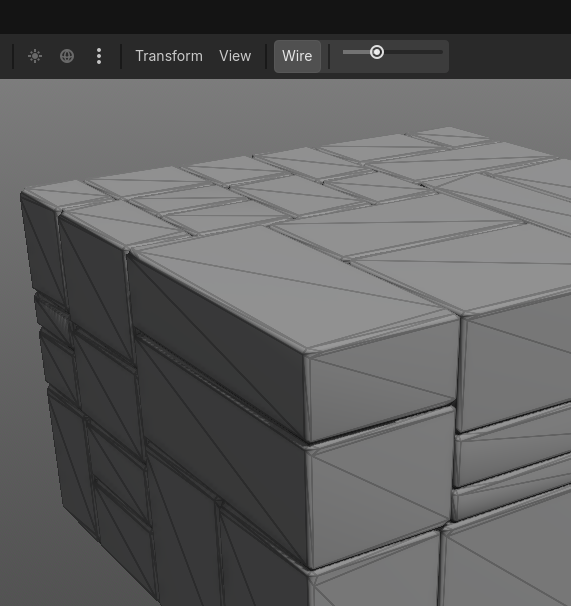

# GD Wires OnShaded

A lightweight editor plugin that adds a **shaded wireframe overlay** to the 3D viewport. See your mesh topology without losing shading.

## Features

- **Wire** toggle button in the 3D viewport toolbar
- Inline opacity slider for quick adjustment
- Works on any MeshInstance3D — no mesh modifications needed
- Barycentric edge detection via shader for clean, thin lines
- Zero runtime cost when disabled

## Installation

1. Copy `addons/wireframe_overlay/` into your project's `addons/` folder
2. Go to **Project → Project Settings → Plugins**
3. Enable **Wireframe Overlay**

## Usage

Click the **Wire** button in the 3D viewport toolbar. An opacity slider appears next to it.

## How It Works

When toggled, the plugin:
1. Finds all visible `MeshInstance3D` nodes in the scene
2. Generates overlay meshes with barycentric coordinates baked into vertex colors
3. Renders edges using a spatial shader with `fwidth()`-based edge detection
4. Overlay meshes are created as children and cleaned up when toggled off

## License

MIT
